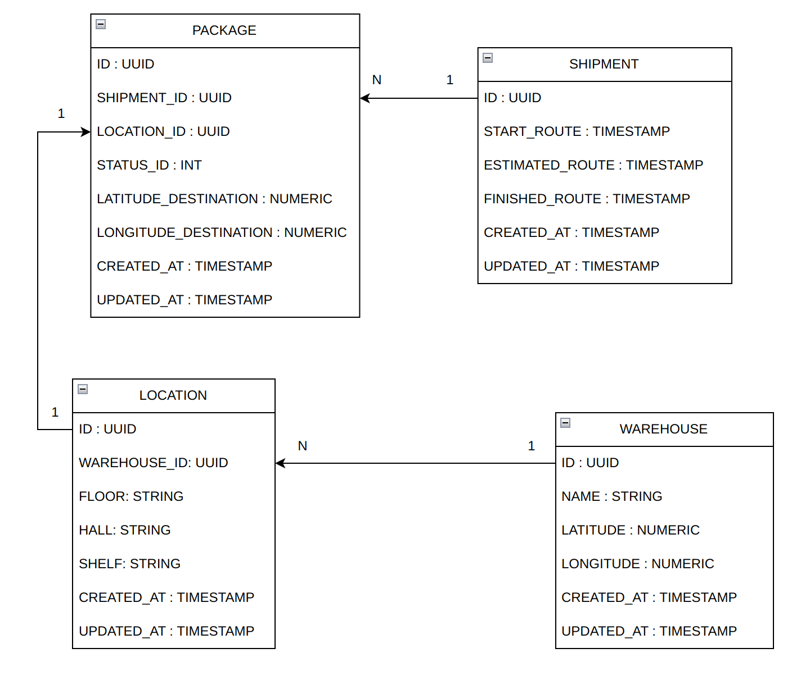

# API - Logistics Management System - By Vinicius Carneiro

## Description

An API responsible to manage storage, inventory and transportation of packages.

## Prerequisites

- [Docker](https://docs.docker.com/get-docker/) >= 20
- [Docker Compose](https://docs.docker.com/compose/install/) >= 1.29

## Running the automated tests

This App is using [Make](https://www.gnu.org/software/make/manual/make.html#Overview) for make easier your execution.

### Unit tests:
```bash
~/oktara-logistics-management$ cd api

# With Make
~/oktara-logistics-management/api$ make setup
~/oktara-logistics-management/api$ make install
~/oktara-logistics-management/api$ make tests

# Without Make
$ docker volume create api-logistics-manager-nodemodules
$ docker-compose -f docker-compose.builder.yml run --rm install
$ docker-compose -f docker-compose.test.yml up
```


### Check the coverage:
```bash
~/oktara-logistics-management$ cd api

# With Make
~/oktara-logistics-management/api$ make setup
~/oktara-logistics-management/api$ make install
~/oktara-logistics-management/api$ make cover

# Without Make
~/oktara-logistics-management/api$ docker volume create api-logistics-manager-nodemodules
~/oktara-logistics-management/api$ docker-compose -f docker-compose.builder.yml run --rm install
~/oktara-logistics-management/api$ docker-compose -f docker-compose.test.cov.yml up
```

## Development

```bash
~/oktara-logistics-management$ cd api

# With Make
~/oktara-logistics-management/api$ make setup
~/oktara-logistics-management/api$ make install
~/oktara-logistics-management/api$ make dev

# Without Make
~/oktara-logistics-management/api$ docker volume create api-logistics-manager-nodemodules
~/oktara-logistics-management/api$ docker-compose -f docker-compose.builder.yml run --rm install
~/oktara-logistics-management/api$ docker-compose -f docker-compose.dev.yml up
```


## Swagger
This projects uses a Swagger as API Documentation. The path is: **/api-docs**

## HealthCheck

This project uses a Terminus as a Healthcheck. In case you needed the path is: **/healthcheck**

## ERD

This is the ERD (Entity Relationship Diagram) for the project:

